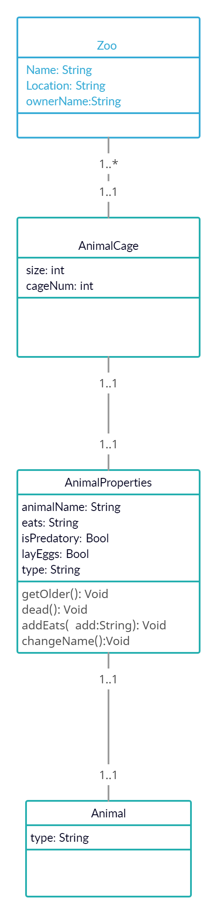

# OOP-Lab
## Ahmad Masadeh

This project about zoo we have 3 layers of inheritance 
Each animal should have a name ,age and type

# UML Diagram

# Technical Documentation
- Zoo Class Contain basic info about the zoo 
- AnimalCage Class Contain basic info about the Cage
- AnimalProperties Class Contain general info for all animal
- Animal Class Contain a specific info for an animal
- IAbimal is a interface for Animal Properties